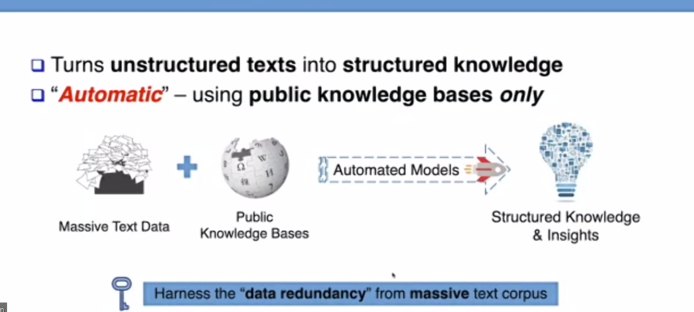
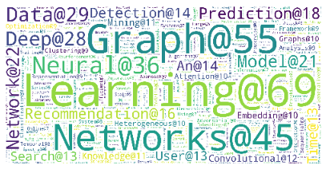

# KDD-2020 statistical information: papers,awards,workshops

## NOTE
This repo is based on the KDD 2020 official website, to summarize the following aspects, for myself and everyone to quickly get the whole idea of this conference.

- the key words of accepted papers
- the topic of accepted papers
- author information of accepted papers
- KDD awards 
- KDD workshop, tutorial

[2012-ACM SIGKDD 数据挖掘及知识发现会议]

An introduction about the history of KDD, the topic of KDD, and the general issue about the 2012 KDD conference to be held in Beijing, China, by Prof. Jiangyong Wang from Tsinghua University.

## KDD 2020
## **summary**:  

- Total num (RT+ADS), Research Track, and Applied Data Science (ADS) track of paper in KDD 2020 is :  **338 217 121 **; 
- Total number of submission: **2035** (the highest in history,over 13% more than the second highest one)
- Research track(long paper): 1279 submition, 216 accepted, **216 / 1279 = 16.9%**; 

### SIGKDD Dissertation Award 

**Dissertation Award Running Up**: [Jingbo Shang](https://shangjingbo1226.github.io/), Assistant professor in UCSD, PHD from UIUC with Prof.Jiawei Han; 

In the speech, Prof.Shang introduced hsi work during PhD study about automatic learning from text: **turning upstructed data into structured knowledge**; 

**QA**:

**1)How to improve our research taste? How to choose a good topic?**

I focused on three parts: *real problem; real data; real solution*. 

**If an algorithm is very specific, if we release some condition, the method will not work that well. So we have the chance to improve.**For example, for my PHD study, supervised learning on text is well studied, but i move to unsupervised learning, to form my phd thesis.

**2)What is your future research interest?**

two things, 

- week supervision. Utilize huge amount of unlabelled data;
- How to combine sturcture and unstructured data;

**Dissertation Award**: [Rediet Abebe](https://www.cs.cornell.edu/~red/), Assistant Professor in UC Berkeley, PHD from Cornell University;

### Test of time award - research

### Test of time award - applied data science

[AenetMiner: Extraction and Mining ]

### ACM SIGKDD  Rising Star Award

### ACM SIGKDD Service Award

Mike Zeller, Head of AI strategy and solutions , Temask

## Some interesting activity in the conference (Lectural Tutorial, workshop, research paper)

**Conference schedule**: [Click here](https://www.kdd.org/kdd2020/schedule)

### 1. Lecture-style Tutorial: Adversarial Attacks and Defenses: Frontiers, Advances and Practice

Presenter: Han Xu, Yaxin Li, Wei Jin, Jiliang Tang, from Michigan State University

[tutorial website](https://sites.google.com/view/kdd-2020-attack-and-defense/)

[tutorial slide](https://drive.google.com/file/d/1Byc7JRI7KRmHLBeYM4zjPdRCCtLWHYI0/view)

### 2. **2020 INTERNATIONAL WORKSHOP ON TALENT AND MANAGEMENT COMPUTING**

[workshop website](http://bigdata.ustc.edu.cn/TMC2020/)

paper list:

- *Salary Prediction Problem as Ordinal Regression, Speaker: Tomoki Ohtsuki*
- *Dynamic Non-negative Matrix Factorization with Temporal Smoothness and Its Application to Email Analysis, Speaker: Mandar Chaudhary*
-  Large-Scale Talent Flow Embedding for Company Competitive Analysis, Speaker: Le Zhang
- *Fine-grained Job Salary Benchmarking with Nonparametric Dirichlet-process-based Latent Factor Model, Speaker: Qinxin Meng*
- *Personalized Employee Tranining Course Recommendation with Career Development Awareness, Speaker: Chao Wang*
- *Research on Medical Talent Evaluation through Applied Behavior Analysis, Speaker: Bo Jin*

topics:

- \- Talent behavior modeling
- \- Talent personality and leadership
- \- Talent performance assessment
- \- Talent recruitment
- \- Talent retention and incentive
- \- Talent email sentiment analysis
- \- Job recommendation
- \- Fairness on recruitment
- \- Skill recommendation
- \- Person-job fit and job satisfaction
- \- Career development
- \- Professional social networks
- \- Team formation and task assignment
- \- Group-based decision-making
- \- Organizational change and stability
- \- Organizational culture and communication
- \- Organizational competition analysis
- \- Strategic management and planning

### 3. 1st ACM SIGKDD Workshop on Deep Learning for Spatiotemporal Data, Applications, and Systems

[workshop website](http://mason.gmu.edu/~lzhao9/venues/DeepSpatial2020/)

topics:

**1)Novel Deep Learning Techniques for Spatial and Spatio-Temporal Data:**
Spatial representation learning and deep neural networks for spatio-temporal data and geometric data
Interpretable deep learning for spatial-temporal data
Deep generative models for spatio-temporal data
Deep reinforcement learning for spatio-temporal decision making problems

**2)Novel Applications of Deep Learning Techniques to Spatio-temporal Computing Problems. :**
Geo-imagery and point cloud analysis (for remote sensing, Earth science, etc.)
Deep learning for mobility and traffic data analytics
Location-based social network data analytics, spatial event prediction and forecasting
Learning for biological data with spatial structures (bio-molecule, brain networks, etc.)

**3)Novel Deep Learning Systems for Spatio-temporal Applications:**
Real-time decision-making systems for traffic management, crime prediction, accident risk analysis, etc.
GIS systems using deep learning (e.g., mapping, routing, or Smart city)
Mobile computing systems using deep learning
Interpretable deep learning systems for spatio-temporal temporal data

**paper list**:

- 1.[Modeling Spatiotemporal Geographic-Semantic Dynamics for Urban Hotspots Prediction](http://mason.gmu.edu/~lzhao9/venues/DeepSpatial2020/papers/DeepSpatial2020_paper_3.pdf)

Guangyin Jin, Hengyu Sha, Yanghe Feng, Cheng Qing and Huang Jincai.

- 2.[Temporal Interpolation of Geostationary Satellite Imagery with Task Specific Optical Flow](http://mason.gmu.edu/~lzhao9/venues/DeepSpatial2020/papers/DeepSpatial_paper_6_camera_ready.pdf)

[Thomas Vandal](https://thomasvandal.com/) and [Ramakrishna Nemani](https://ecocast.arc.nasa.gov/).

- 3. [Fusion Recurrent Neural Network](http://mason.gmu.edu/~lzhao9/venues/DeepSpatial2020/papers/DeepSpatial2020_paper_7_camera_ready.pdf)

Yiwen Sun, Yulu Wang, Kun Fu, Zheng Wang, [Changshui Zhang](http://bigeye.au.tsinghua.edu.cn/english/Introduction.html) and [Jieping Ye](https://medicine.umich.edu/dept/dcmb/jieping-ye-phd).

- 4. [DeepSampling: Selectivity Estimation with Predicted Error and Response Time](http://mason.gmu.edu/~lzhao9/venues/DeepSpatial2020/papers/DeepSpatial2020_paper_8_camera_ready.pdf)

[Tin Vu](http://www.cs.ucr.edu/~tvu032/) and [Ahmed Eldawy](http://www.cs.ucr.edu/~eldawy/).

- 5. Generate Street Map Images from Satellite Images and Crowd-sourced Geographic data using GAN

Ying Zhang, Yifang Yin, [Roger Zimmermann](https://www.comp.nus.edu.sg/~rogerz/roger.html), Guanfeng Wang and [Jagannadan Varadarajan](https://sites.google.com/site/vjagan/).

- 6. [Transformer Hawkes Process](http://mason.gmu.edu/~lzhao9/venues/DeepSpatial2020/papers/DeepSpatial2020_paper_11.pdf)

[Simiao Zuo](https://www.isye.gatech.edu/users/simiao-zuo), [Haoming Jiang](https://hmjianggatech.github.io/), Zichong Li, [Tuo Zhao](https://www.isye.gatech.edu/users/tuo-zhao) and [Hongyuan Zha](https://scholar.google.com/citations?user=tqEWl8gAAAAJ&hl=en).

- 7. [Towards Spatial Variability Aware Deep Neural Networks (SVANN): A Summary of Results](http://mason.gmu.edu/~lzhao9/venues/DeepSpatial2020/papers/DeepSpatial2020_paper_13_camera_ready.pdf)

[Jayant Gupta](http://www-users.cs.umn.edu/~gupta423/index.html), [Yiqun Xie](https://www-users.cs.umn.edu/~xiexx347/) and [Shashi Shekhar](https://www-users.cs.umn.edu/~shekhar/).

- 8. [Deep Multi-Sensor Domain Adaptation on Active and Passive Satellite Remote Sensing Data](http://mason.gmu.edu/~lzhao9/venues/DeepSpatial2020/papers/DeepSpatial2020_paper_14_camera_ready.pdf)

Xin Huang, Sahara Ali, [Sanjay Purushotham](https://informationsystems.umbc.edu/home/faculty-and-staff/faculty/), [Jianwu Wang](https://userpages.umbc.edu/~jianwu/), Chenxi Wang and [Zhibo Zhang](https://physics.umbc.edu/people/faculty/zhang/).

### 4. Research track: Unsupervised learning 3

**paper list**:

- CICLAD: A Fast and Memory-efficient Closed Itemset Miner for Streams
- Parameterized Correlation Clustering in Hypergraphs and Bipartite Graphs
- A Non-Iterative Quantile Change Detection Method in Mixture Model with Heavy-Tailed Components
- Learning Based Distributed Tracking
- Stable Learning via Differentiated Variable Decorrelation

### 5. Workshop: Urban Computing

## Generate word_cloud based on paper keyword statistics

problem: 
- Many special keyword (e.g., Adversarial Network, neural network) are divided into two or more single word, which contradicts with the true situation;
- Case, singular and plural should not be sensitive; 

## Classify papers by topics

problem：
- Should be able to automatically find important topics in the title and abstract; (Human-crafted topics need domain knowledge, easy to omit topics, bad generalization ability)
- Should be able to cluster similar topics to form one keyword;

To be finished...

|topic|num_papers|
|:----|:----|
|graph|74|
|convolutional neural networks|6|
|unsupervised|6|
|generative adversarial|6|
|reinforcement learning|6|
|time series|5|
|semi-supervised|5|
|real-time|5|
|GAN|4|
|GNN|4|
|multi-task|4|
|GCN|3|
|meta-learning|3|
|Federated|2|
|privacy|2|
|private|1|
|interpretability|1|
|Knowledge Distillation|1|
|co-training|1|
|CNN|1|
|GANs|1|
|transfer learning|1|

